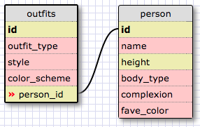

1. SELECT * FROM states;
2. SELECT * FROM regions;
3. SELECT state_name, population FROM states;
4. SELECT state_name, population FROM states ORDER BY population  DESC;
5. SELECT state_name FROM states WHERE region_id=7;
6. SELECT state_name, population_density FROM states WHERE population_density > 50 ORDER BY population_density ASC;
7. SELECT state_name FROM states WHERE population BETWEEN 1000000 AND 1500000;
8. SELECT state_name, region_id FROM states ORDER BY region_id ASC;
9. SELECT region_name FROM regions WHERE region_name LIKE "%Central%";
10. SELECT regions.region_name, states.state_name FROM regions INNER JOIN states ON regions.id=states.region_id ORDER BY states.region_id ASC;

REFLECTION

What are databases for?
Databases are used to store sets of related information in an organize manner. They are easy to navigate and break down into smaller components, and are therefore more useful for storing large amounts of information than hashes and arrays.

What is a one-to-many relationship?
A one-to-many relationship when database information can be stored in a seperate database using a shared id with the original database. This avoids unnecessary repetition and reduces the size of a large database. For example, my kitchen contains many drawers, but each drawer contains different things. It would make sense to create a "counter" database that contains basic drawer information and "drawer" databases linked with their unique contents.

What is a primary key? What is a foreign key? How can you determine which is which?
A primary key is a unique identification/"id", normally a number, for each row of a database. It should be on the first column of every line. A foreign key is typically a number that can be used to access information stored in another database. It can be assigned to multiple rows of a database.

How can you select information out of a SQL database? What are some general guidelines for that?
The SELECT statement can be used to select information from a database. From there, you can select all with * or specifically target a column from specific tables. You can decide the order or limit the amount of data using specific parameters, as well as search for specific items within a column or table.
