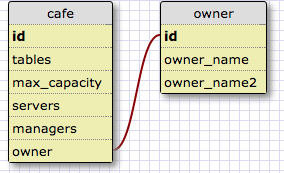

What is a one-to-one database? When would you use a one-to-one database? (Think generally, not in terms of the example you created).
A one-to-one database is a database that connects two databases with a single relationship to one another. The second database will often connect to a field in the first database labelled with its id. This kind of database should be used when you need to expand on a field within a in a way that would make for sense to have it listed as a seperate table instead of repeating infromation within the main table.

What is a many-to-many database? When would you use a many-to-many database? (Think generally, not in terms of the example you created).
A many-to-many database is a database of several tables that have information that needs to be connected but are otherwise dissimilar. A join table can be used to connect the two databases so they are accessible to each other.
This kind of database is useful to link a wide range of information that can't all be listed in one table in a way that would make senses.

What is confusing about database schemas? What makes sense?
Database schemas mostly make sense to me, though the example in release 1 threw me off initially.